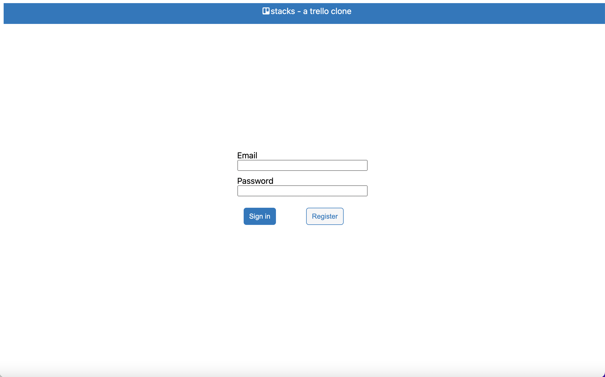
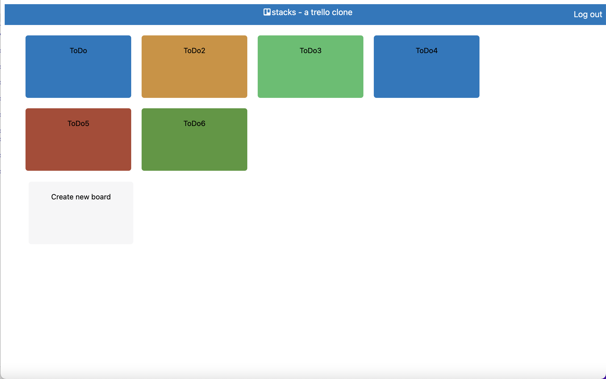
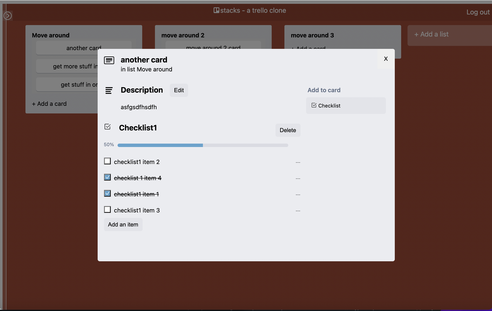

# stacks - a trello clone 

- Built with [Remix](https://remix.run/docs), [React](https://reactjs.org/), [Supabase](https://supabase.com/)
- Deployed with [Netlify](https://www.netlify.com/)







## Development

The Netlify CLI starts your app in development mode, rebuilding assets on file changes.
You'll need a copy of .env with environment variables.

```sh
npm run dev
```

Open up [http://localhost:3000](http://localhost:3000), and you should be ready to go!

```
