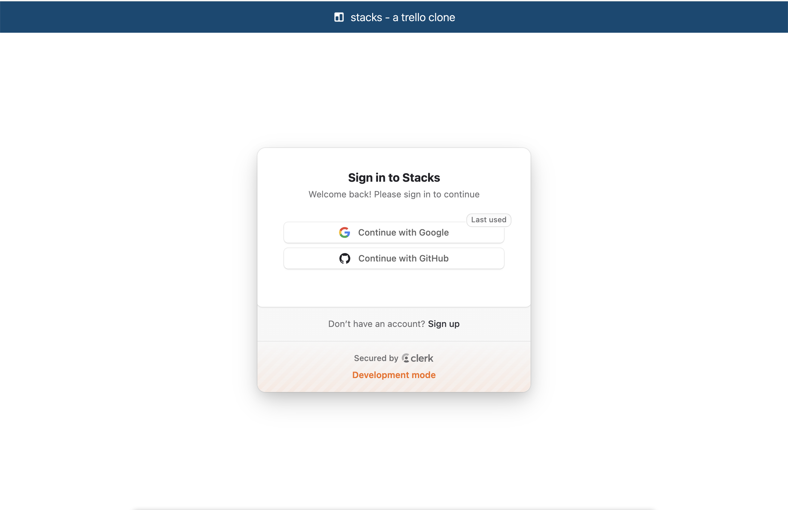
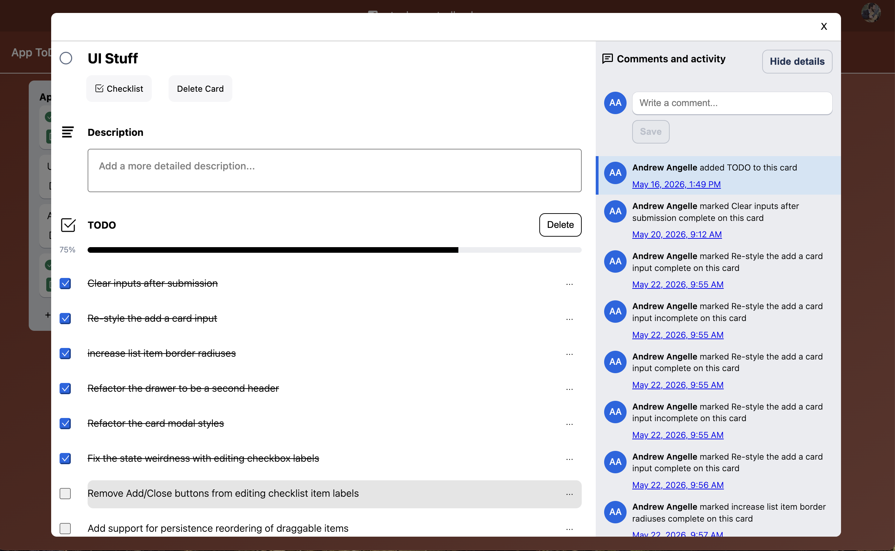
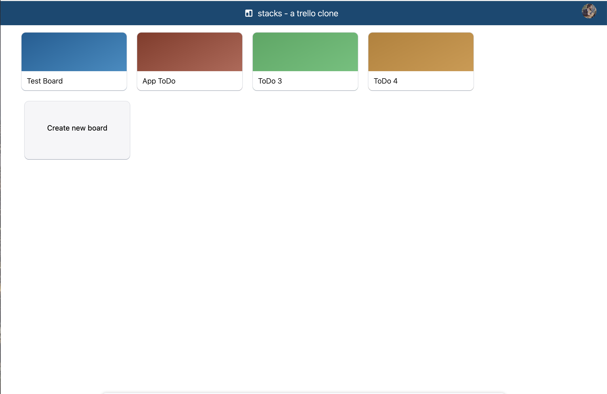

# stacks - a trello clone 

[Try it out](https://stacks-app.fyi)

- Built with [Tanstack Start](https://tanstack.com/start/latest), [React](https://react.dev/), [Neon](https://neon.com/), [Clerk](https://clerk.com/)
- Deployed with [Netlify](https://www.netlify.com/)







## Testing

E2E tests use [Playwright](https://playwright.dev/) against a dedicated dev server with mocked database and auth—no Clerk or Postgres credentials needed.

```bash
pnpm test                  # all browsers
pnpm test --project=chromium  # same as CI
```

See [tests/README.md](tests/README.md) for how tests are structured and how to add new user-journey coverage.

